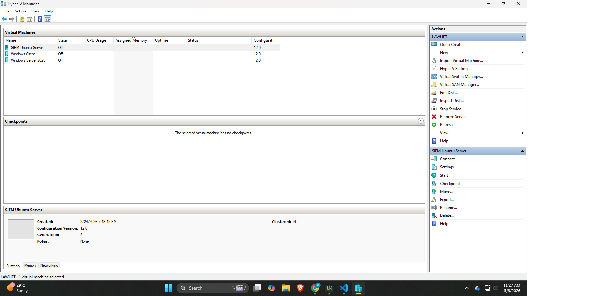
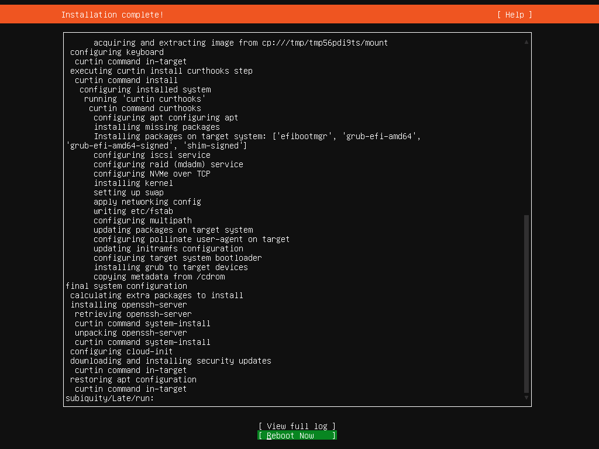
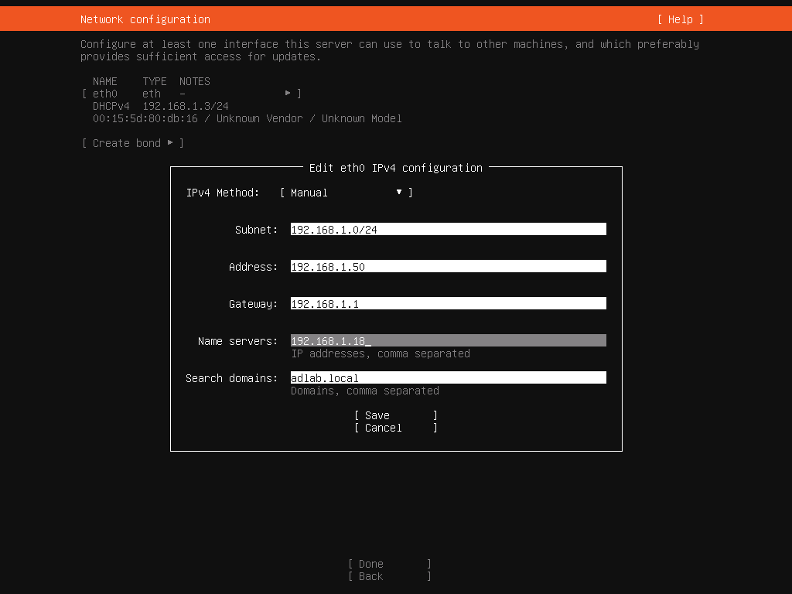
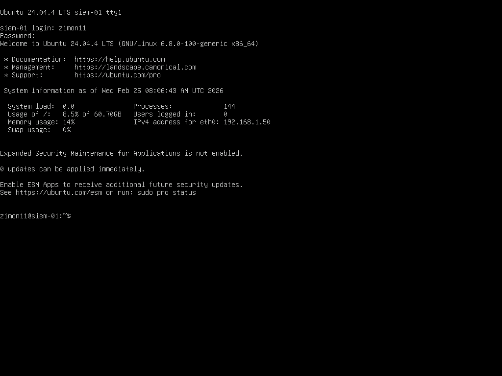

⬅️ [Previous: Lab Architecture](02-lab-architecture.md) | [Next: Active Directory Installation and Configuration ➡️](04-ad-installation-configuration.md)

# Step 1: ⚙️ Installation and Configuration

### Step 1.1: Ubuntu SIEM server in Hyper-V as a Virtual Machine

- Added a new Virtual Machine for Ubuntu server with Ubuntu ISO image for installation.
---
### Step 1.2: Installing Ubuntu

- Successfully Installed Ubuntu Server on the Virtual Machine.
---
### Step 1.3: Configuring Ubuntu

- Configured a Static IP address of ubuntu including and a DNS server to point out the IP address of the Domain controller for better Domain name resolution.
---
### Step 1.4: Verified Complete Installation

- Logged-in as the Ubuntu Server admin account to verify its complete installation.
---
⬅️ [Previous: Lab Architecture](02-lab-architecture.md) | [Next: Active Directory Installation and Configuration ➡️](04-ad-installation-configuration.md)
