⬅️ [Previous: Installation and Configuration](03-installatation-configuration.md) | [Next: SIEM Wazuh Intallation ➡️](04-siem-wazuh-installation.md)

# Step 2: ⚙️ SIEM Wazuh Installation

### Step 2.1: Download the wazuh installation assistant and the configuration file
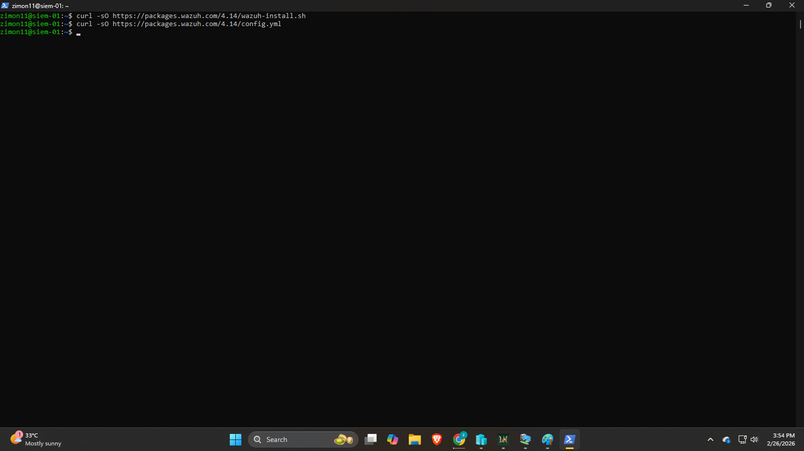
- In the wazuh documentation, followed the step and downloaded the guide for installing the wazuh by the command in the image.

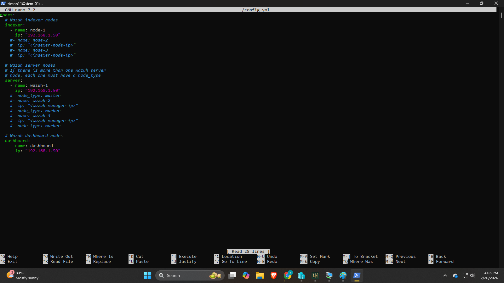
- Edited the configuration file ./config.yml using the command **sudo nano** and configure the ip address to corresponds the server IP address.

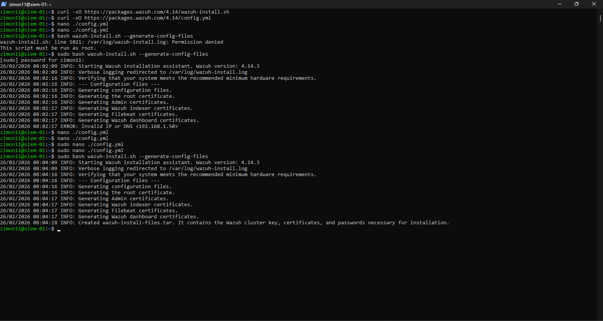
- Run the installation assistant of the wazuh with the option **--generate-config-files** to generate the Wazuh cluster key, certificates, and the password necessary for installation.
- The files can be find in **./wazuh-install-files.tar**.

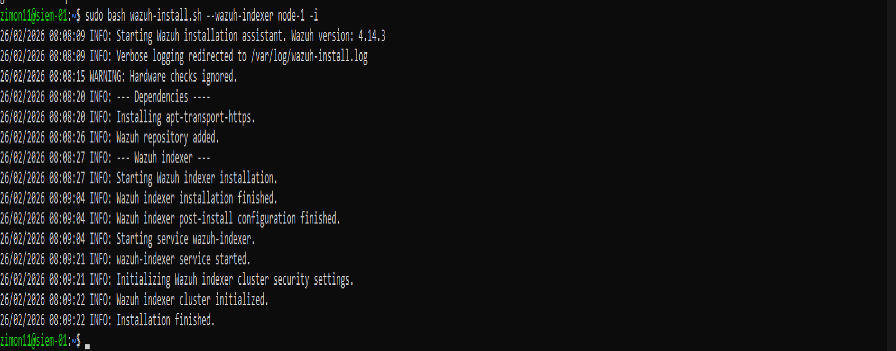
- For Wazuh indexer Run the installation assistant with the option **--wazuh-indexer** and the name of the node to configure and install the wazuh indexer.
- The name of the node must be the same as the one used in **config.yml**.
- Does the same step when installing both Wazuh Server and Wazuh Dashboard by using these commands instead **bash wazuh-install.sh --wazuh-server wazuh-1** for Wazuh server and **bash wazuh-install.sh --wazuh-dashboard dashboard** for Wazuh Dashboard.

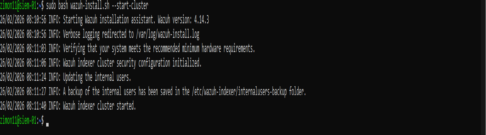
- Run the installation assistant of wazuh with the option **--start-cluster** on any wazuh indexer node to load the certificates information and start new cluster.

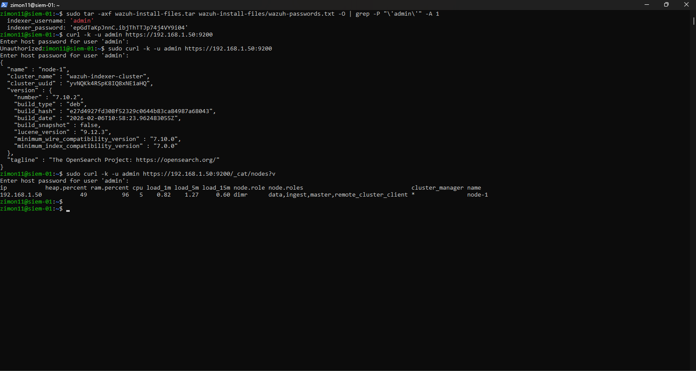
- Get the Wazuh admin account password.
- Verified the wazuh index installation is successful.
- Verified if the cluster is properly working.

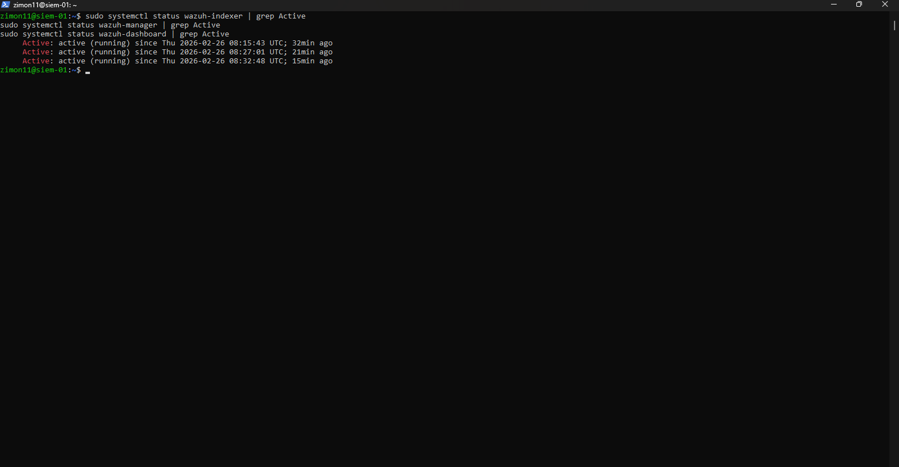
- Verified all of the Wazuh components if running properly.
---

### Step 2.2: Validation Step: Verified that the Wazuh is working
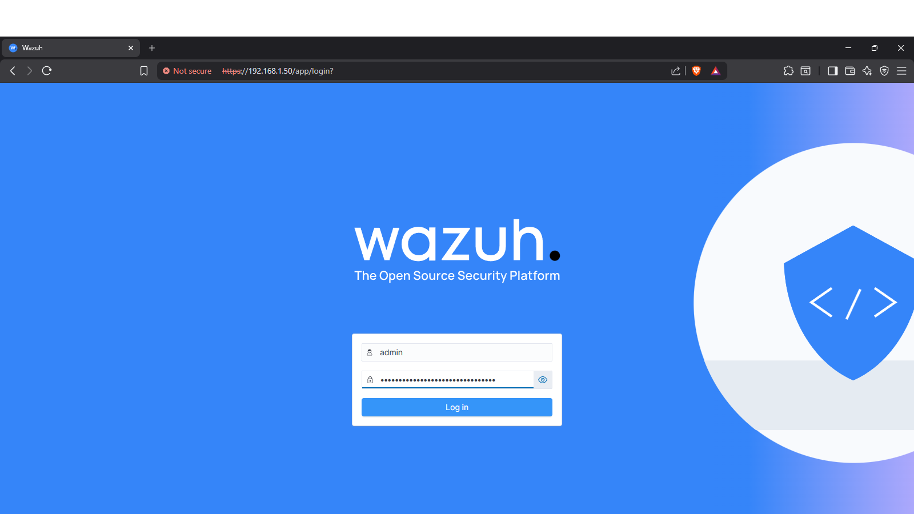
- Verified that the Wazuh is working by going in the Wazuh Dashboard.
- Logged-in using the Wazuh admin credentials.

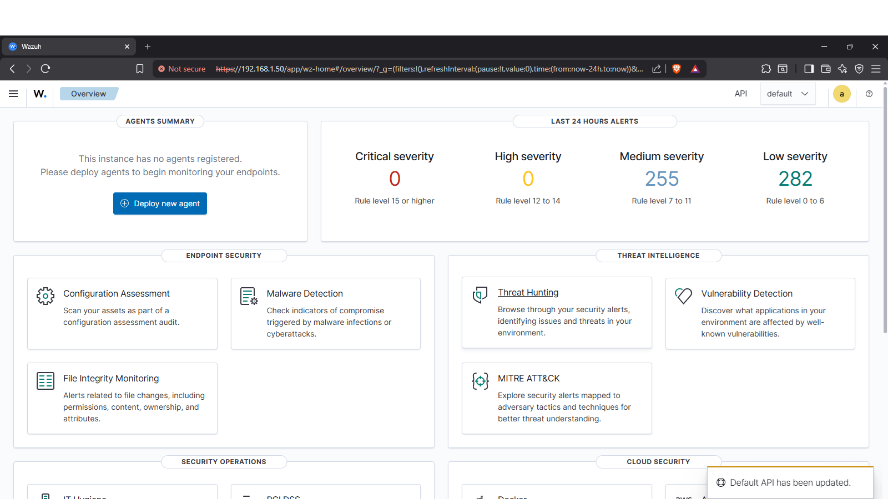
- Successfully logge-in as the wazuh admin and displays the dashboard page of wazuh.
---

### Step 2.3: Deploying agent in Wazuh and Wazuh Agent Installation
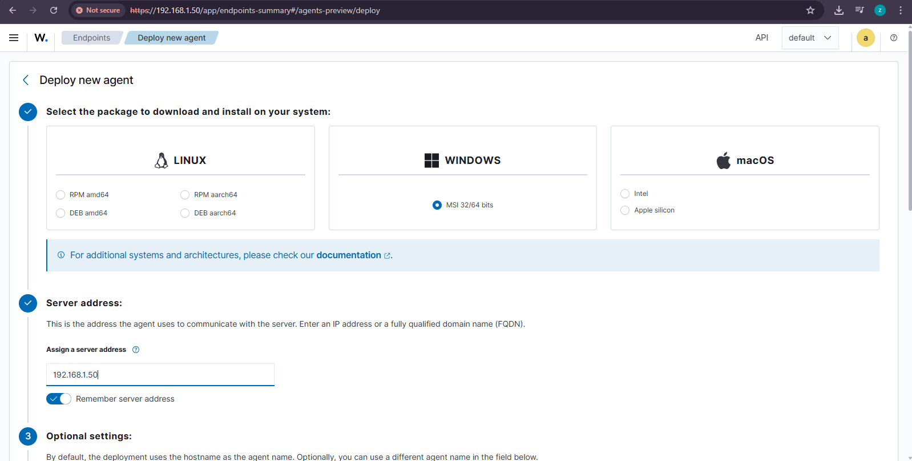
- In Agent management of wazuh, chosed windows as my agent and added the IP address of the Wazuh Server.

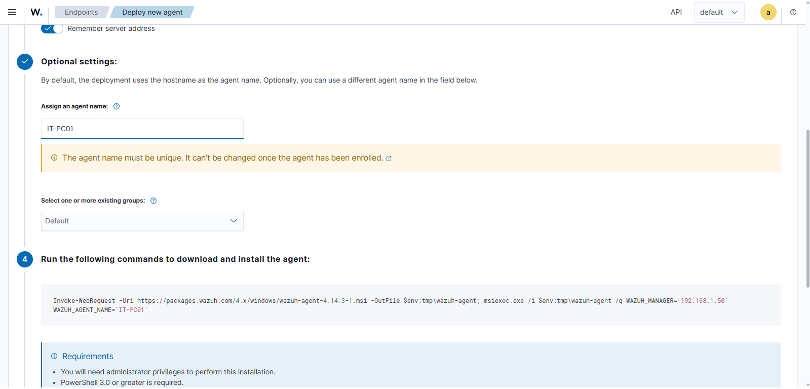
- Added a name for the agent to correspond the name of the device itself for better identification.
- Copied the command below for later installation of Wazuh Agent in the Windows device.

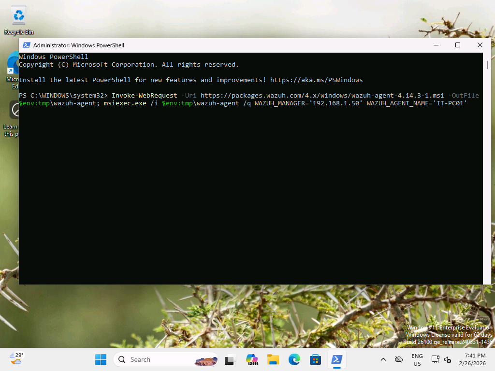
- In the Windows Client(A domain joined device within the same network as the Wazuh Server), pasted the command in the powershell to install Wazuh Agent.

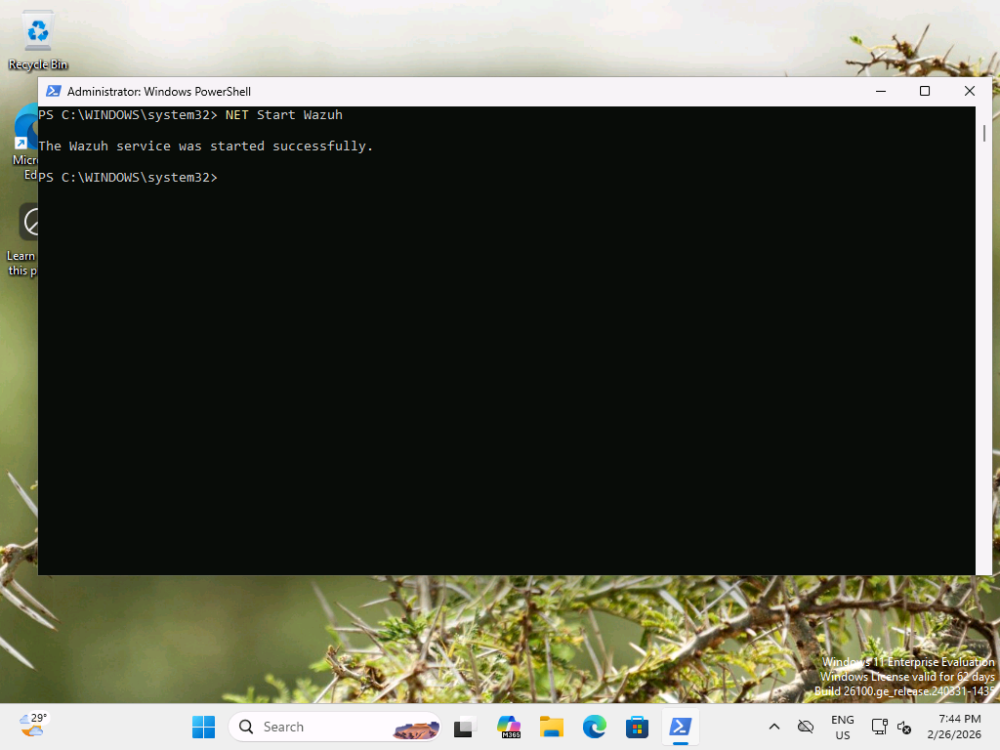
- Type the command NET Start Wazuh to start monitoring the Windows Client using Wazuh Agent.
---
### Step 2.4: Validation Step: Verified that agent was successfully added in the endpoint
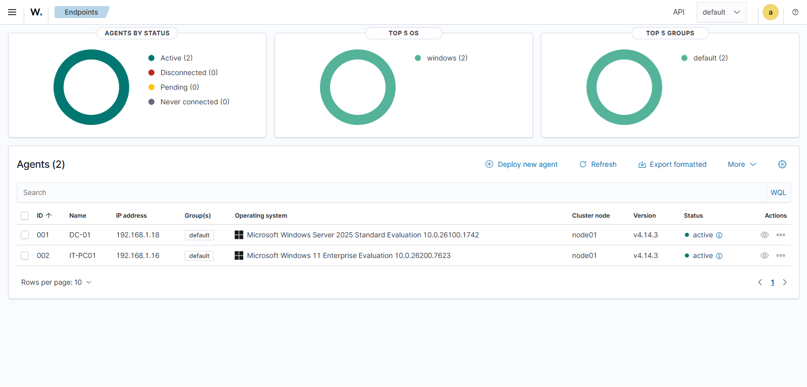
- In the Wazuh Dashboard Agent management, Verified the endpoints was successfully running to continously monitor each of the device logs.
⬅️ [Previous: Installation and Configuration](03-installatation-configuration.md) | [Next: SIEM Wazuh Intallation ➡️](04-siem-wazuh-installation.md)
